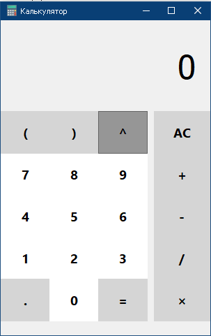

# Калькулятор на PyQt5
### Скриншот


### Управление
В программе можно использовать следующие клавиши
```
0 1 2 3 4 5 6 7 8 9
- +  * / ^ ( ) .
D - Очистить
Esc - Выход
Enter - Посчитать
Backspace - Удалить последний символ
```

### Запуск
`python main.py`
